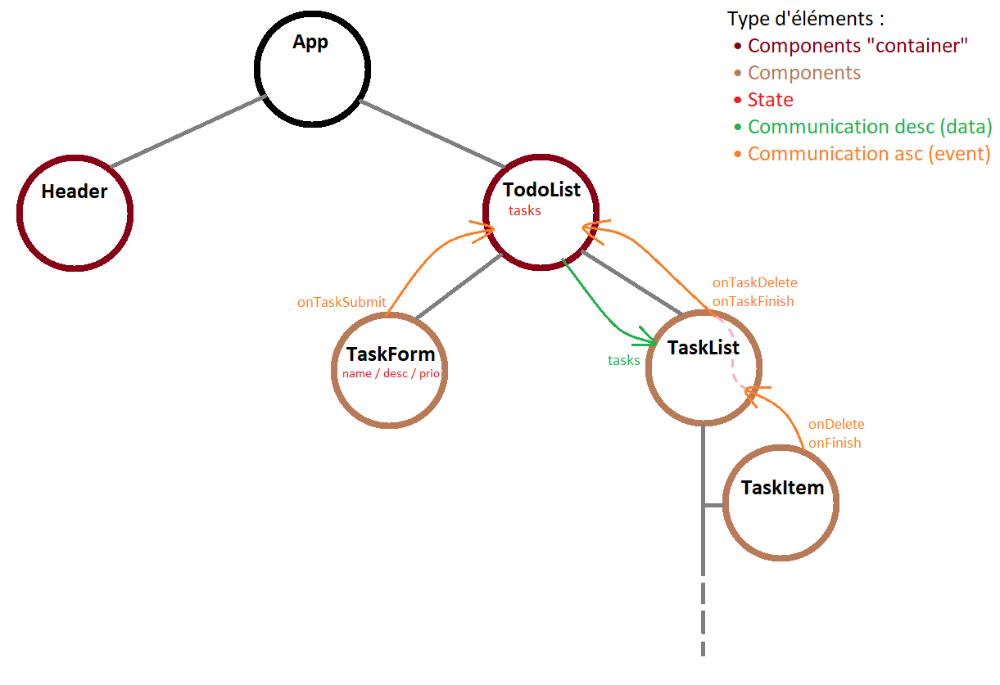

# Exo 05 - TodoList

## Structure des composants de l'app

## Méthodologie de travail
- Réaliser la structure de l'app _(Peut toujours évoluer)_
    - Définir les composants
    - Visualiser le flux de donnée (State + communication)
- Coder... 
    - Créer un composant _(Simple)_
    - Ajouter de la logique et/ou les interactions au composant
    - Passer à la fonctionnalité / composant suivant

### Ordre de dev durant la correction
- Composant Header
- Composant TodoList _(Simple)_
- Composant TaskForm
    - [Si basé sur un mockup] Adapter le code html en JSX 
    - Ajouter le style _(SCSS)_
    - Gestion du formulaire _(Binding entre le form et le state)_
    - Interaction avec TodoList _(Props "Event" -> pour envoyé l'element au parent)_
